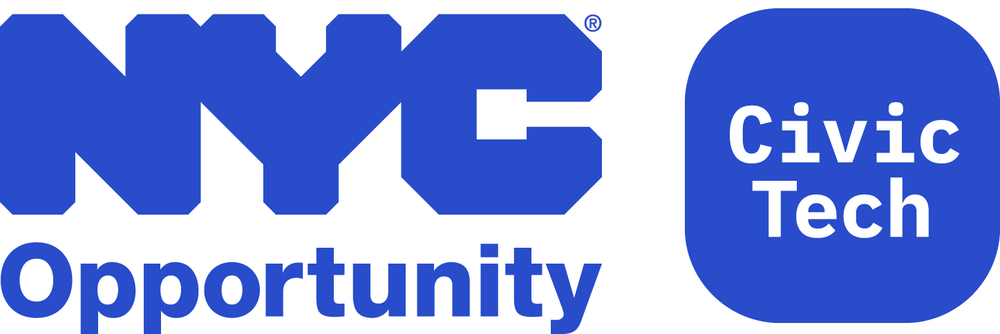

# NYC Benefits Screening API Postman Collection

Postman Collection for testing the NYC Benefits Screening API maintained by [@nycopportunity](https://github.com/NYCOpportunity). Screen clients for **benefits at scale** or create **new benefits screening tools**. Send household composition data to eligibility rules for **35+** City, State, and Federal programs including SNAP, Cash Assistance, WIC, HEAP, and more. To learn more about the API view the public documentation at [screeningapidocs.cityofnewyork.us](https://screeningapidocs.cityofnewyork.us).

## Usage

**$1** You will need to have an account for using the API. [See getting started for more details](https://screeningapidocs.cityofnewyork.us/getting-started).

  * You will receive an email for access to the API from **no-reply@screeningapi.cityofnewyork.us** with a username and verification code that can be used to set your password.

**$2** Download [Postman](https://www.getpostman.com/) if you do not currently have it.

**$3** **Import** the **collection** and the **environment** JSON files. The import button can be found in the top left of the application window.

* You may either download or clone a copy of this repository and import the folder.

* Or, import the raw GitHub user content from the following URLs;
  * [Collection](https://raw.githubusercontent.com/CityOfNewYork/screeningapi-postman-collection/main/NYC%20Benefits%20Platform%20Screening%20API.postman_collection.json)
  * [Environment](https://raw.githubusercontent.com/CityOfNewYork/screeningapi-postman-collection/main/NYC%20Benefits%20Platform%20Screening%20API.postman_environment.json)

* More details on [importing collections can be found in the Postman documentation](https://learning.postman.com/docs/getting-started/importing-and-exporting-data/).

**$4**  **Set up the environment**. Select the **NYC Benefits Screening API** environment in the top right corner of the application window and click the 👁️ (eye) button to view, then click **edit** in the dropdown. Fill in your `{{ username }}` and `{{ password }}`. If you haven't set your password yet, you may use the **Confirm Password** endpoint in the collection to do so. You may also use the [Change Password Form](https://screeningapidocs.cityofnewyork.us/change-password-form) in the documentation.

* The `{{ domain }}` is preset to use the **sandbox domain**; sandbox.screeningapi.cityofnewyork.us. This should be used for testing requests.

* The **production domain** is screeningapi.cityofnewyork.us.

## Endpoints

### Authentication

The **Authentication** endpoints are contained at the root of the collection. They will use the environment variables for values in the request body.

### Eligibility

The **Eligibility** directory in the collection has a [pre-request script](pre-request-script.js) that will reset the token environment variable for each endpoint in the folder. More details about authentication can be found on the [Token-based Authentication](https://screeningapidocs.cityofnewyork.us/token-based-authentication) page.

#### Bulk Submission / Import

The `Bulk Submission / Import` directory contains a basic request and a filtered programs request. The [sample_bulk_submission_import.csv](sample_bulk_submission_import.csv) included in this repository can be used as a template. In the **Body** tab of the request, you can click "Select File" to use it.

#### Eligibility Programs

The `Eligibility Programs` has a preset **Household Composition Data** object. It can be modified according to the documentation in the [Making a Request](https://screeningapidocs.cityofnewyork.us/making-a-request) page or rebuild using the [Request Builder](https://screeningapidocs.cityofnewyork.us/request-builder) tool.

---

[The Mayor's Office for Economic Opportunity](http://nyc.gov/opportunity) is committed to sharing open-source software that we use in our products. Feel free to ask questions and share feedback. **Interested in contributing?** See our open positions on [buildwithnyc.github.io](http://buildwithnyc.github.io/). Follow our team on GitHub [@nycopportunity](https://github.com/orgs/NYCOpportunity) and [@cityofnewyork:nycopportunity](https://github.com/orgs/CityOfNewYork/teams/nycopportunity) or [browse our work on Github](https://github.com/search?q=nycopportunity).